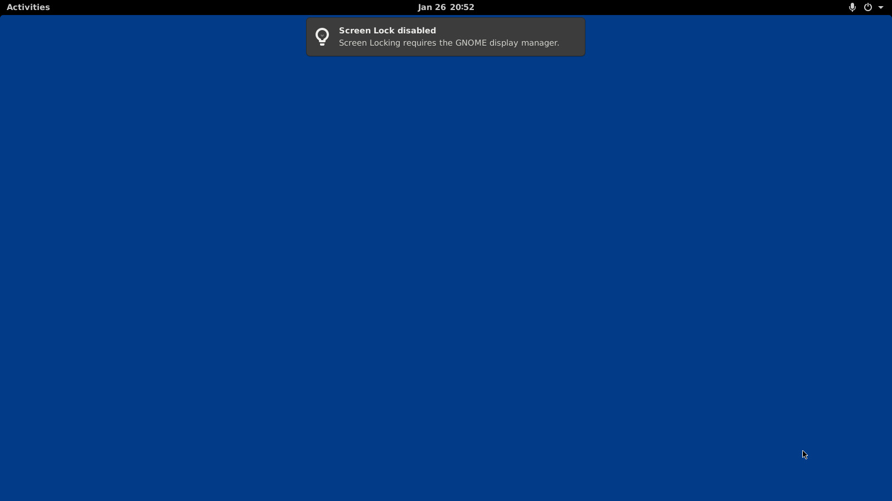

# 📦 A container running GNOME Shell via xvfb

_:warning: Disclaimer: I have very little to no experience with Docker / Podman. I am sure that many aspects of this project can be improved significantly! Please report any suggestions via [GitHub Issues](https://github.com/Schneegans/gnome-shell-pod/issues)!_

## 🎉 The Idea

Developing high-quality extensions for GNOME Shell is challenging due to various reasons.
One major issues is the lack of continuous integration possibilities.
So I thought: Why not try getting GNOME Shell running on the runners of GitHub Actions?

Of course I know that this is exactly what Docker & Podman are not designed to be used for...


## 🔧 How Does It Work?


## ✅ How Do I Use It?

Some notes:

```bash
podman build -t ghcr.io/schneegans/gnome-shell:1.0.0 .
podman push ghcr.io/schneegans/gnome-shell:1.0.0
podman run --rm -it gnome-shell:1.0.0
podman cp $(podman ps -q -l):/opt/Xvfb_screen0 . && convert xwd:Xvfb_screen0 capture.jpg && eog capture.jpg
podman stop $(podman ps -q -l)

# podman exec -it $(podman ps -q -l) gdbus call --session --dest org.gnome.Shell --object-path /org/gnome/shell/extensions/flypie --method org.gnome.Shell.Extensions.flypie.ShowMenu 'Example Menu'
```

<p align="center">
  
</p>

## :octocat: Contributing

Commits should start with a Capital letter and should be written in present tense (e.g. __:tada: Add cool new feature__ instead of __:tada: Added cool new feature__).
You should also start your commit message with **one** applicable emoji.
This does not only look great but also makes you rethink what to add to a commit. Make many but small commits!

Emoji | Description
------|------------
:tada: `:tada:` | When you added a cool new feature.
:wrench: `:wrench:` | When you added a piece of code.
:art: `:art:` | When you improved / added assets like themes.
:rocket: `:rocket:` | When you improved performance.
:memo: `:memo:` | When you wrote documentation.
:beetle: `:beetle:` | When you fixed a bug.
:twisted_rightwards_arrows: `:twisted_rightwards_arrows:` | When you merged a branch.
:fire: `:fire:` | When you removed something.
:truck: `:truck:` | When you moved / renamed something.
