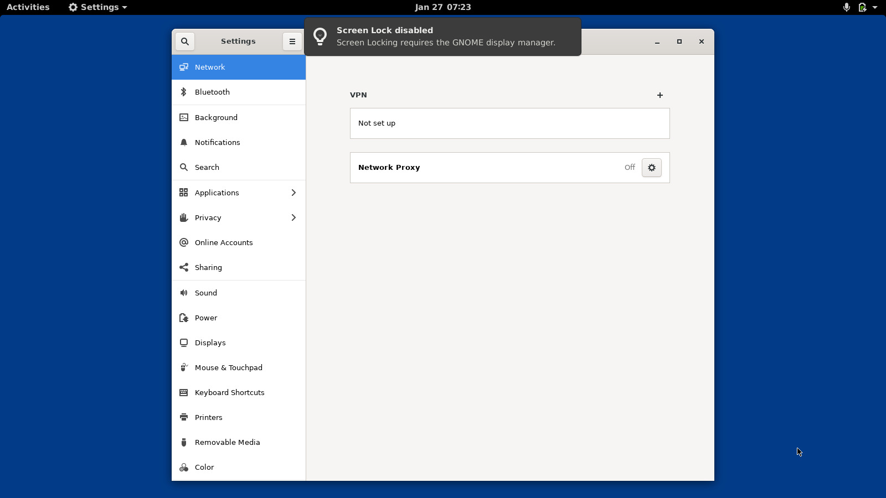
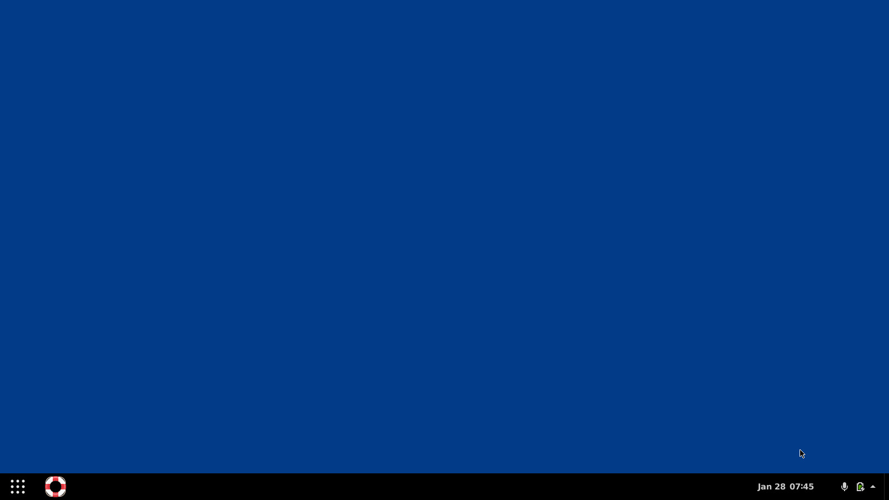
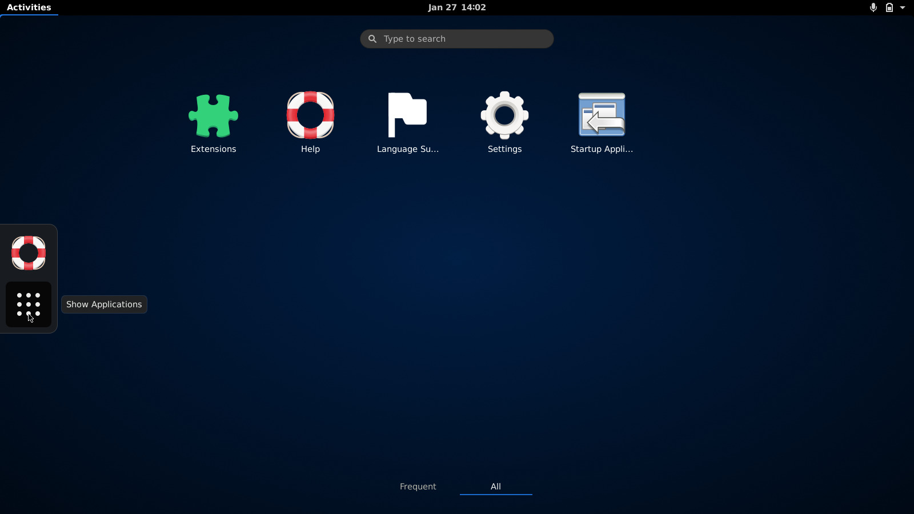

# 📦 Run GNOME Shell in a Container!

_:warning: Disclaimer: I have very little to no experience with Docker / Podman. I am sure that many aspects of this project can be improved significantly! Please report any suggestions via [GitHub Issues](https://github.com/Schneegans/gnome-shell-pod/issues)!_

## The Idea

Developing high-quality GNOME Shell extensions is challenging due to various reasons.
One major issues is the lack of continuous integration possibilities.
So I thought: Why not try getting GNOME Shell running on the runners of GitHub Actions?
Of course I know that this is exactly what Podman is not designed to be used for...

**Anyway, here is what already works:**
- [x] GNOME Shell runs automatically when the container is started.
- [x] You can launch other applications, such as `gnome-control-center`.
- [x] You can make "screenshots" of GNOME Shell and transfer them to host memory.
- [x] You can install a GNOME Shell extension from host memory and enable it.
- [x] You can use `xdotool` to interact with the extension.
- [x] All of this works locally and on the GitHub hosted runners!


## How Does It Work?

The Ubuntu-based image contains `systemd`, `gnome-shell`, `gnome-shell-extension-prefs`, `xvfb`, and `xdotool`.
A user called "gnomeshell" will auto-login via `systemd-logind.service.d` and run `gnome-shell` via `xvfb`.
The framebuffer of `xvfb` is mapped to a file which can be copied to host memory and converted to an image.
This way we can actually make "screenshots" of GNOME Shell!

## How Do I Use It?

For the following examples you will need to install imagemagick (for converting the xvfb framebuffer image) and, obviously, Podman.
On Ubuntu-like distributions you can install them with this command:

```bash
sudo apt-get install imagemagick podman
```
### Basic Usage

Use the commands below to start GNOME Shell in the container and capture a screenshot.

```bash
# Run the container in detached mode.
podman run --rm -td ghcr.io/schneegans/gnome-shell-3.38:latest

# Wait some time to make sure that GNOME Shell has been started.
sleep 5

# Copy the framebuffer of xvfb.
podman cp $(podman ps -q -n 1):/home/gnomeshell/Xvfb_screen0 .

# Convert it to jpeg.
convert xwd:Xvfb_screen0 capture.jpg

# And finally display the image.
# This way we can see that GNOME Shell is actually up and running!
eog capture.jpg

# We can stop the container again.
podman stop $(podman ps -q -n 1)
```


<p align="center">
  
</p>

### Interactive Usage

If you want to play around with GNOME Shell inside the pod, use these commands:

```bash
# Run the container in interactive mode. This will automatically login the root user and
# start GNOME Shell in the background. While you will see the output from GNOME Shell,
# you will be able to execute commands from an interactive shell.
podman run --rm -ti ghcr.io/schneegans/gnome-shell-3.38:latest

# For example, you can run this command inside the container:
gnome-control-center

# Now use another terminal on your host to capture and display a screenshot.
# podman cp $(podman ps -q -n 1):/home/gnomeshell/Xvfb_screen0 . && convert xwd:Xvfb_screen0 capture.jpg && eog capture.jpg

# You can kill the gnome-control-center with Ctrl-C and the poweroff the container.
poweroff
```

<p align="center">
  
</p>


### Testing an Extension

In this example, we will start the container, install and enable an extension from extensions.gnome.org and finally create a screenshot.


```bash
# Run the container in detached mode.
podman run --rm -td ghcr.io/schneegans/gnome-shell-3.38:latest

# Wait some time to make sure that GNOME Shell has been started.
sleep 5

# Download an extension.
wget https://extensions.gnome.org/extension-data/dash-to-paneljderose9.github.com.v40.shell-extension.zip

# Rename it to UUID.zip. This is expected by the enable-extension.sh script.
mv dash-to-paneljderose9.github.com.v40.shell-extension.zip dash-to-panel@jderose9.github.com.zip

# Copy the archive to the container.
podman cp dash-to-panel@jderose9.github.com.zip $(podman ps -q -n 1):/home/gnomeshell/

# Execute the install script. This installs the extension, restarts GNOME Shell and
# finally enables the extension.
podman exec --env DISPLAY=:99 --user gnomeshell $(podman ps -q -n 1) /home/gnomeshell/enable-extension.sh dash-to-panel@jderose9.github.com

# Wait some time to make sure that GNOME Shell has been restarted.
sleep 2

# Then make a "screenshot" and display the image.
podman cp $(podman ps -q -n 1):/home/gnomeshell/Xvfb_screen0 . && convert xwd:Xvfb_screen0 capture.jpg && eog capture.jpg

# Finally stop the container.
podman stop $(podman ps -q -n 1)
```

<p align="center">
  
</p>

### Interacting with GNOME Shell

If you started the container in detached mode, you can execute commands inside the container using `podman exec`. In this example we will use `xdotool` to simulate mouse input.

```bash
# Run the container in detached mode.
podman run --rm -td ghcr.io/schneegans/gnome-shell-3.38:latest

# Wait some time to make sure that GNOME Shell has been started.
sleep 5

# Click the activities button.
podman exec --user gnomeshell --env DISPLAY=:99 $(podman ps -q -n 1) xdotool mousemove 10 10 click 1 
sleep 1

# Click the applications grid button.
podman exec --user gnomeshell --env DISPLAY=:99 $(podman ps -q -n 1) xdotool mousemove 50 550 click 1 
sleep 1

# Then make a "screenshot" and display the image.
podman cp $(podman ps -q -n 1):/home/gnomeshell/Xvfb_screen0 . && convert xwd:Xvfb_screen0 capture.jpg && eog capture.jpg

# Finally stop the container.
podman stop $(podman ps -q -n 1)
```

<p align="center">
  
</p>

### Using This in a GitHub Action

When you try to use this container in a GitHub actions workflow, you will need to run podman with `sudo` (for whatever reason).
But it works! Once the workflow run is finished, you can download the screenshot as artifact.

```yaml
name: Tests

on:
  push:
    branches:
      - '**'
  pull_request:
    branches:
      - '**'

jobs:
  test:
    runs-on: ubuntu-latest
    steps:
    - name: Run GNOME Shell
      run: |
        sudo apt-get install imagemagick -qq
        POD=$(sudo podman run --rm -td ghcr.io/schneegans/gnome-shell-3.38:latest)
        sleep 5
        sudo podman cp $POD:/home/gnomeshell/Xvfb_screen0 . && convert xwd:Xvfb_screen0 capture.jpg
        sudo podman stop $POD
    - name: Upload Screenshot
      uses: actions/upload-artifact@v2
      with:
        name: screenshot
        path: capture.jpg
```


## :octocat: Contributing

Commits should start with a Capital letter and should be written in present tense (e.g. __:tada: Add cool new feature__ instead of __:tada: Added cool new feature__).
You should also start your commit message with **one** applicable emoji.
This does not only look great but also makes you rethink what to add to a commit. Make many but small commits!

Emoji | Description
------|------------
:tada: `:tada:` | When you added a cool new feature.
:wrench: `:wrench:` | When you added a piece of code.
:art: `:art:` | When you improved / added assets like themes.
:rocket: `:rocket:` | When you improved performance.
:memo: `:memo:` | When you wrote documentation.
:beetle: `:beetle:` | When you fixed a bug.
:twisted_rightwards_arrows: `:twisted_rightwards_arrows:` | When you merged a branch.
:fire: `:fire:` | When you removed something.
:truck: `:truck:` | When you moved / renamed something.
